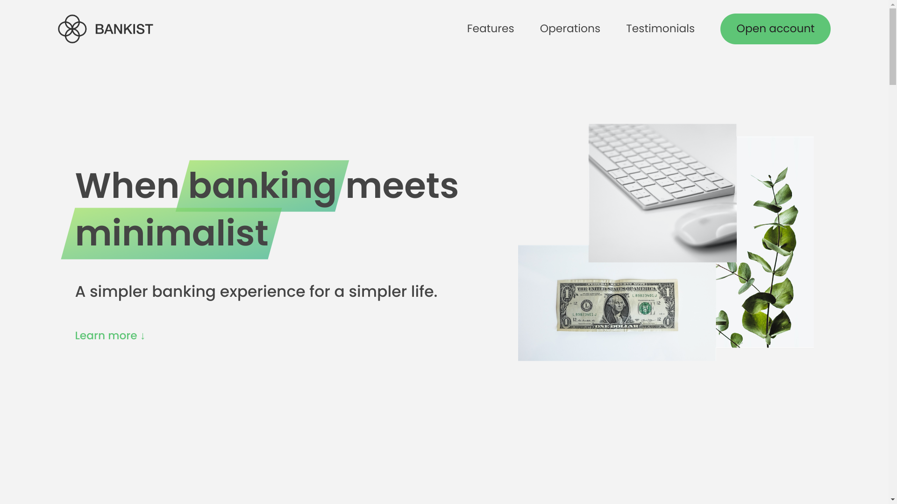

# BANKIST

## Description

Bankist is a mock banking website landing page, linking to their live online banking section.
This project showcases lazy loading, intersection API and various web design principles.

## How to run the Project

Project is live at [*THIS LINK*](https://siddhart-singh.github.io/Bankist-Landing-Page/)

## How to use the Project

1. Open the link above.
2. Clicking on OPEN ACCOUNT takes you to online banking section. Checkout [this repo](https://github.com/siddhart-singh/ATM-App) for instructions on how to use it.

## Technology

1. HTML, CSS
2. JavaScript
3. Linux
4. [Git](https://git-scm.com/)
5. [Ion Icons](https://ionic.io/ionicons)
6. [Icons8](https://icons8.com/)
7. [Google Fonts](https://fonts.google.com/)
